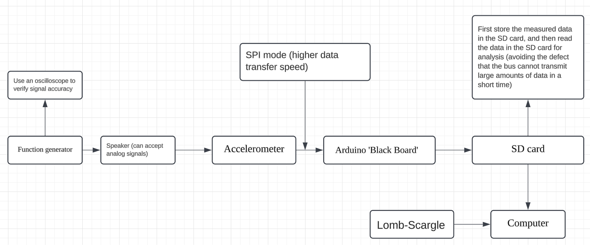
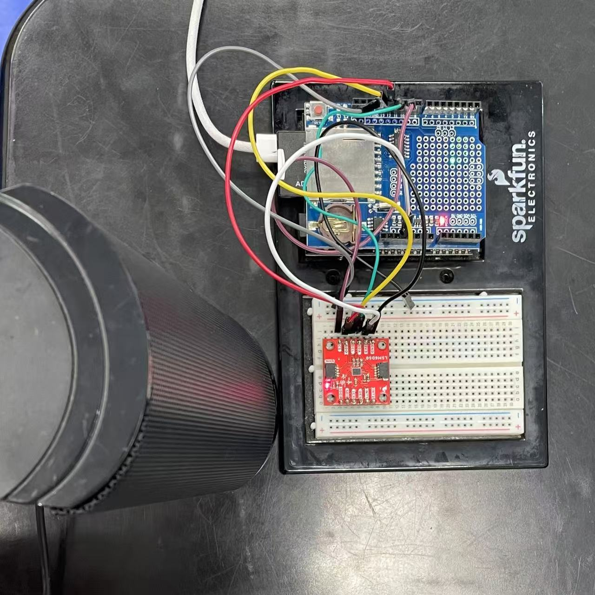

# Sound-Induced Vibration Analysis Using LSM6DSO Accelerometer

This repository contains the implementation, setup, and results of our study investigating the frequency response of the [**SparkFun 6 Degrees of Freedom Breakout - LSM6DSO (SEN-18020)**](https://www.sparkfun.com/products/18020) accelerometer to sound-induced vibrations. Our objective was to explore its sensitivity across human sound frequency range and evaluate its potential for vibration-based sensing applications.

---
## Overview

The project examines the accelerometer's response to sound waves in the 40 Hz to 840 Hz range, covering the fundamental frequency range of human speech. By generating controlled single-frequency audio tones using a speaker and recording the vibration data, we analyzed the accelerometer’s frequency-dependent sensitivity.

Key highlights include:
- We use Scipy [**Lomb-Scargle periodogram**](https://docs.scipy.org/doc/scipy/reference/generated/scipy.signal.lombscargle.html) for spectral reconstruction of non-uniformly sampled data.
- Enhanced sampling rate through integrated SPI and SD card data acquisition sy
- Identification of high frequency responce at ~120 Hz, 300 Hz, 390 Hz, and 810 Hz.
---

## Experimental Flowchart

Below is the flowchart outlining our experimental process:

---

## Experimental Setup

The experimental setup consists of the following components:
- **Accelerometer**: SparkFun LSM6DSO (SEN-18020)
- **Speaker**: External analog speaker
- **Function Generator**: To generate precise audio signals
- **Oscilloscope**: To verify input signal accuracy
- **Arduino BlackBoard with SPI mode**: For high-speed data collection
- **SD Card**: To store data before analysis

The accelerometer was mounted on a plastic tabletop in direct contact with the speaker to ensure stable transmission of vibrations. However, it should be noted that resonance occurred in the plastic tabletop between 400-450 Hz, which affected the direct contact between the speaker and accelerometer. Data was collected at a sampling frequency sufficient to capture vibration dynamics.

### Setup Image

---

## Results: Normalized Frequency Response

The figure below shows the normalized frequency response of the accelerometer across the tested frequency range. Peaks around 120 Hz, 300 Hz, 390 Hz, and 810 Hz indicate regions of higher sensitivity, while troughs highlight lower sensitivity at certain frequencies.
Code can be found in [Responce.ipynb](Responce.ipynb).

### Observations:
- **Peaks**: Indicate resonant frequencies where the accelerometer is highly sensitive to vibrations.
- **Troughs**: Suggest frequencies with reduced sensitivity, potentially due to material or hardware limitations.
- **Trend Analysis**: A smoothed trend line (LOWESS) provides a clearer view of overall sensitivity variations.

---

## Key Takeaways

- The **SparkFun LSM6DSO accelerometer** demonstrates frequency-dependent sensitivity, with notable resonance peaks. However, we encountered an unexpected phenomenon: despite an average sampling interval of 2ms (approximately 500Hz sampling rate) through SD card acquisition - which according to the Nyquist theorem should only allow detection up to 250Hz - we were able to detect frequency peaks up to 840Hz. The mechanism behind this anomaly remains unclear and requires further investigation.
- Direct contact with a plastic tabletop provided optimal transmission of sound-induced vibrations.
- Using the **Lomb-Scargle periodogram** allowed accurate spectral analysis of non-uniform data, highlighting the accelerometer’s frequency response characteristics.

---

## How to Cite

If you use this project in your research, please cite this website and contact us zichen_song@u.nus.edu.
